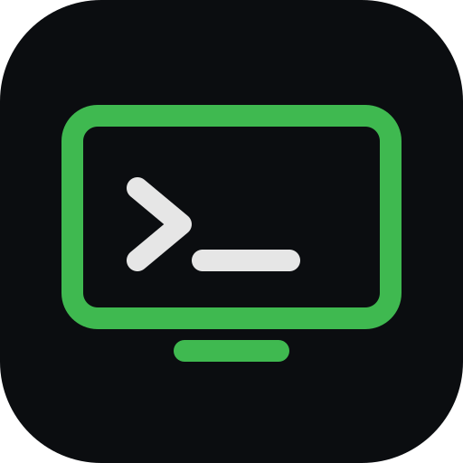

<!-- LOGO -->
<h1>
<p align="center">
  
  <br>shanframe
</h1>
  <p align="center">
    Your machines, from anywhere — for you <em>and</em> your agents.
    <br />
    Every terminal, every screen, every app, on every device you own.
    <br />
    <a href="#about">About</a>
    ·
    <a href="https://shanframe.com">Website</a>
    ·
    <a href="#install">Install</a>
    ·
    <a href="#use">Use</a>
    ·
    <a href="#for-agents">For agents</a>
  </p>
</p>

## About

shanframe connects your devices into one private mesh. Install it on a
machine and that machine is on your list — open its terminal or its live
desktop from your phone, your laptop, or any browser, and forward its ports
anywhere. Sessions run directly between your devices over WebRTC, end-to-end
encrypted; the server only introduces them. Nothing on your machine listens
on the internet.

It's built for agents as much as for people: everything you can do by hand,
an agent can do from this CLI — run a command on another machine, take a
screenshot, click and type on its screen, drive its browser, borrow its
network.

This repository is the **shanframe agent and CLI** — the program that runs on
your machines. It is open source so you can read exactly what you're
installing. The hosted service at [shanframe.com](https://shanframe.com)
(accounts, rendezvous, encrypted relay) is what makes it work out of the box;
the server side is not in this repository.

## Install

```sh
curl -fsSL https://shanframe.com/install.sh | sh
```

One line per machine: it downloads the agent, links the machine to your
account (approve a 6-character code from any signed-in device), and installs
itself as a service — starts at boot, keeps itself updated, rolls back on its
own if an update misbehaves. macOS and Linux; no root required on Linux.

From source: `go build ./cmd/shanframe`, then `shanframe join`.

## Use

```sh
shanframe ls [--json]              # your machines and what each offers
shanframe <dev>                    # live terminal (name prefixes work)
shanframe <dev> run -- <cmd>       # run a command: stdout/stderr/exit code
shanframe <dev> tunnel 5432        # its port, local here (--socks, --install)
shanframe <dev> cdp                # its Chrome DevTools, local here
shanframe <dev> screenshot|click|type|key|batch   # see and operate its screen
shanframe <dev> startcmd 'tmux attach'            # what every new terminal runs
```

## For agents

[`skills/shanframe/SKILL.md`](skills/shanframe/SKILL.md) is a ready-made
skill for coding agents (Claude Code and friends): list devices, run
commands, screenshot → act → verify, tunnel ports, drive a remote browser.
An agent on any device on your list can use every other one — with your
permissions, revocable in a tap.

## License

Apache-2.0. Third-party components are listed in
[THIRD_PARTY_NOTICES.md](THIRD_PARTY_NOTICES.md).
